# Azure Cognitive Search: Utilizando AI Search para indexação e consulta de Dados

## Click the + Create a resource button, search for Azure AI Search, and create a Azure AI Search resource with the following settings:

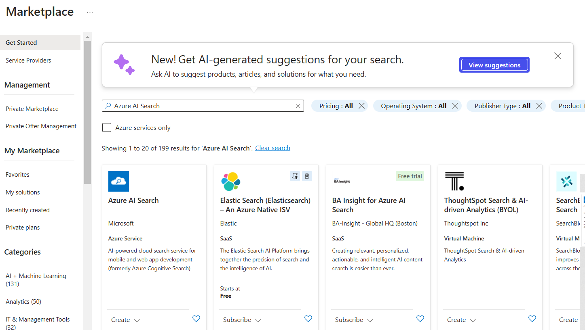

## Create a search service

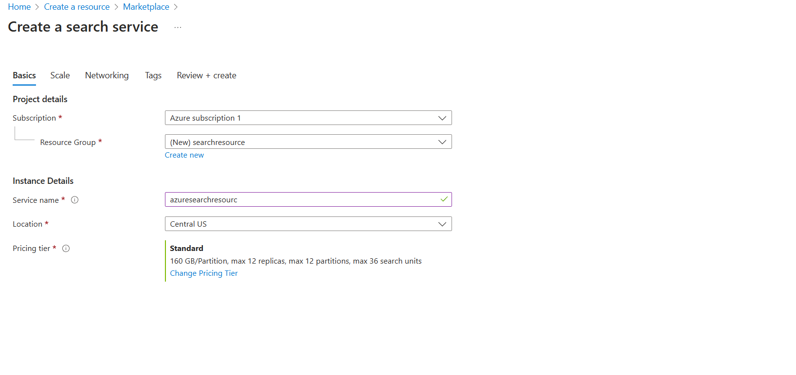

## Go to your resource

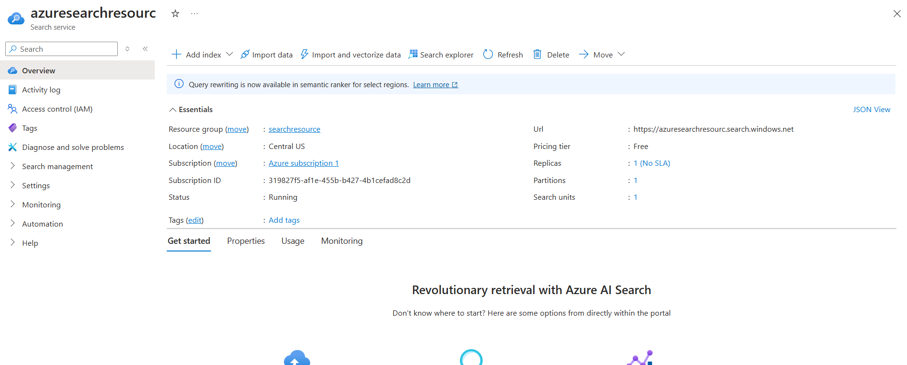

## Create an Azure AI services resource

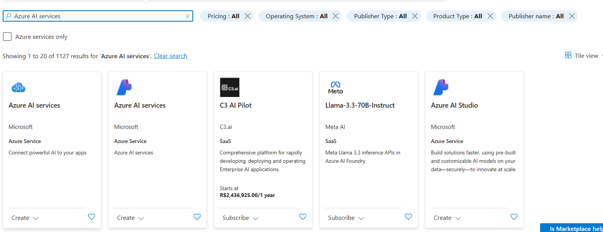

## Create Azure AI services

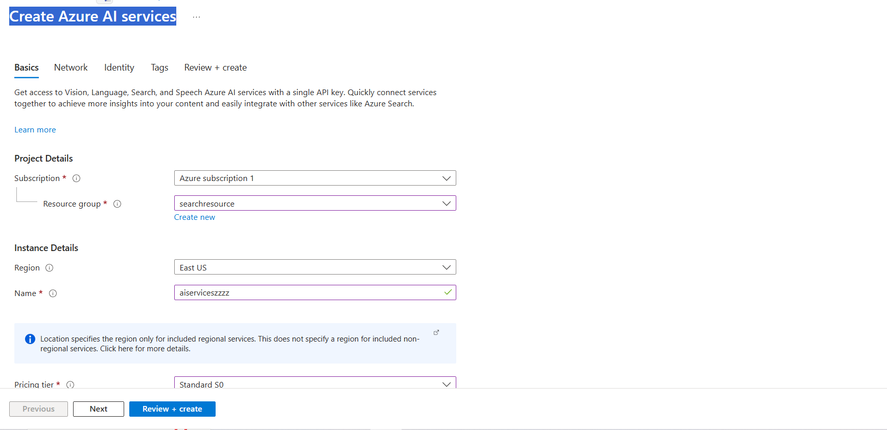

## Go to resource

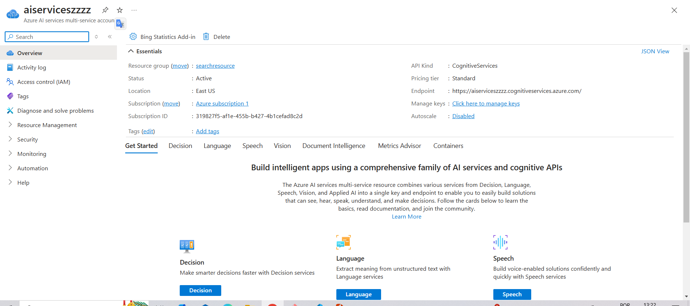

## Create a storage account

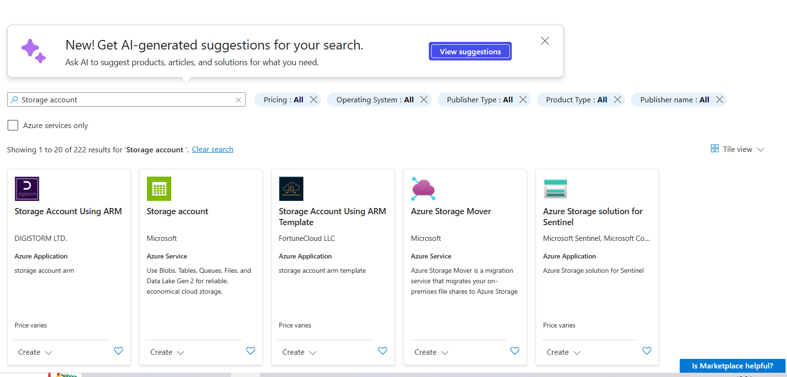

## Confirm

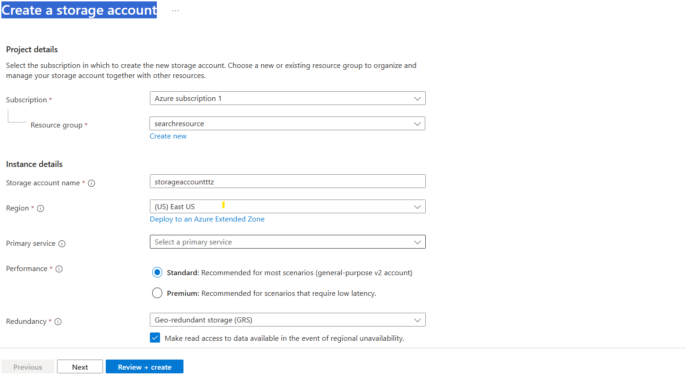

## Go to resource

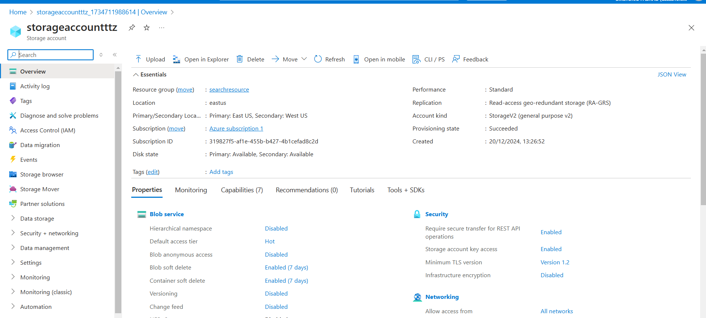

## Create Container 

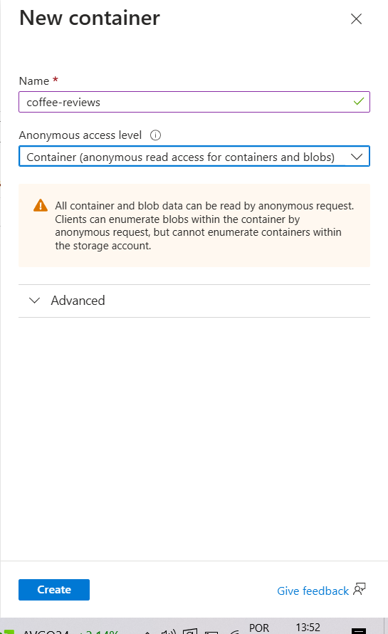

## Upload Blob

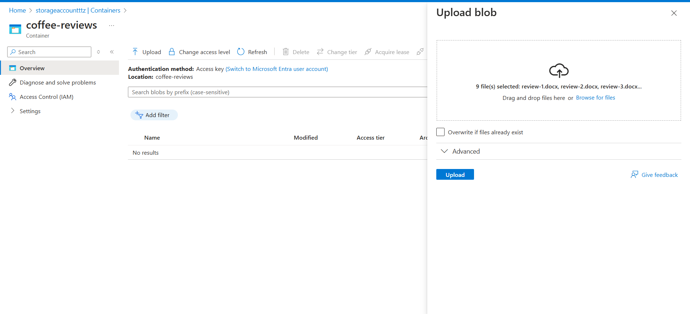

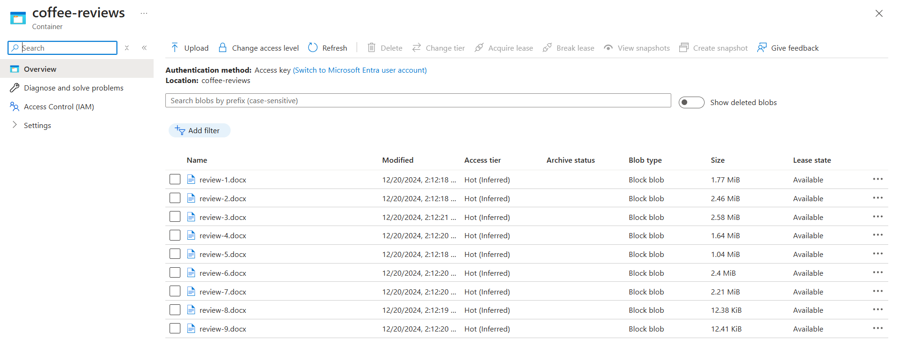

## Index the documents

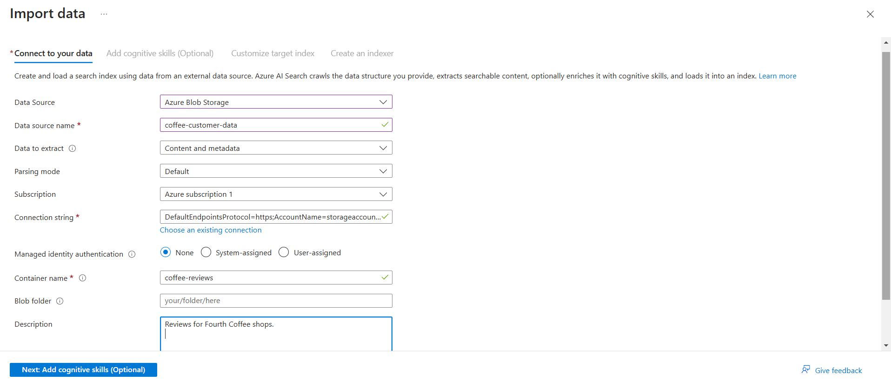

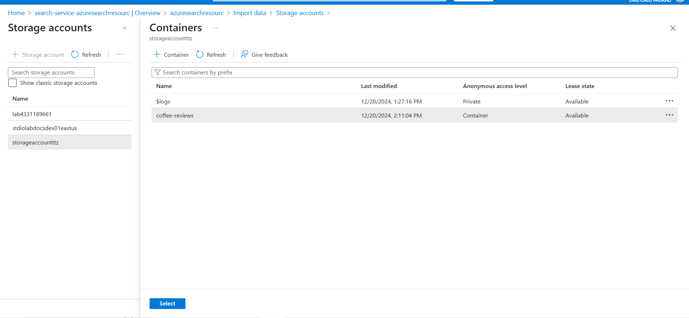

## Import data

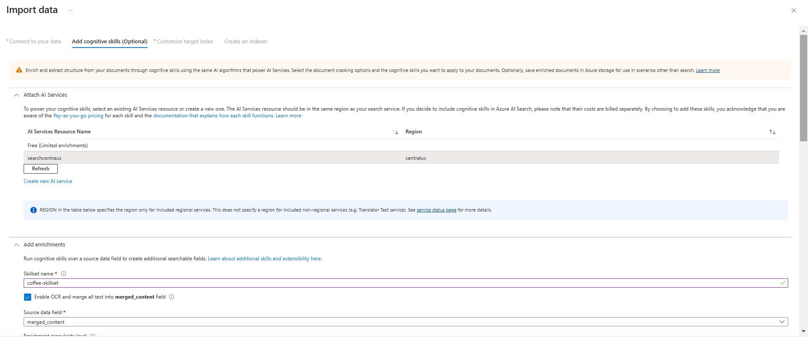

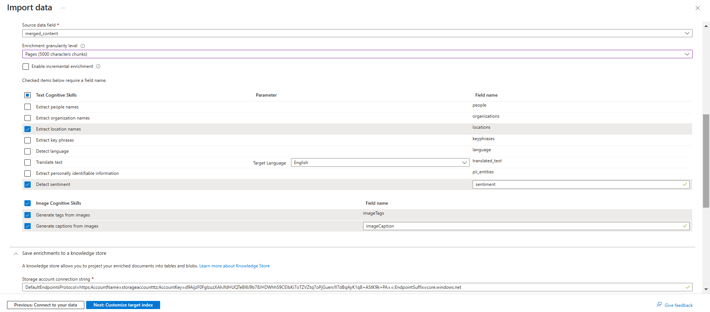

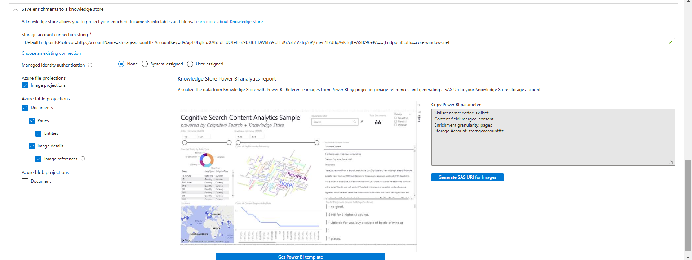

## Customize target index

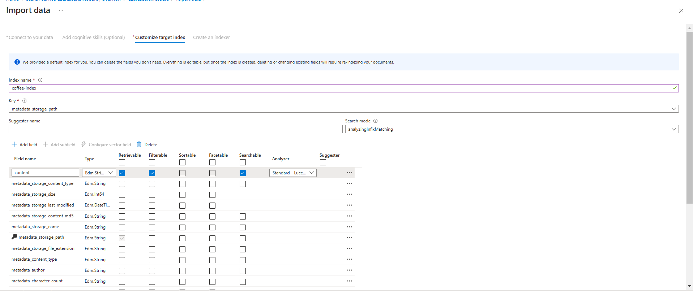

## Create an indexer

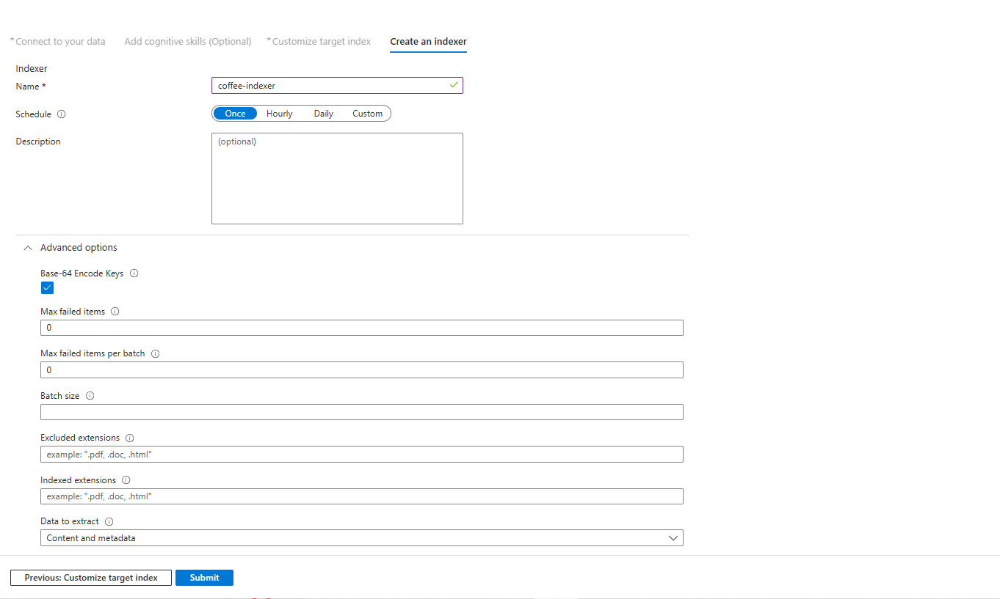

## Return to your Azure AI Search resource page. On the left pane, under Search Management, select Indexers. Select the newly created coffee-indexer. Wait a minute, and select &orarr; Refresh until the Status indicates success.

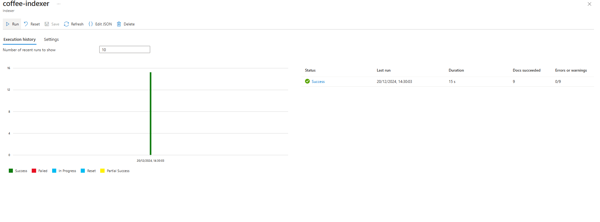

## Query the index

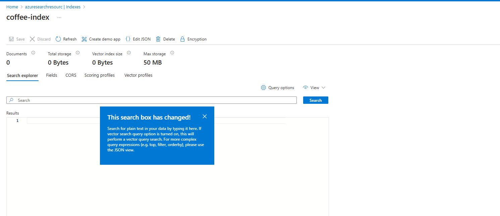

